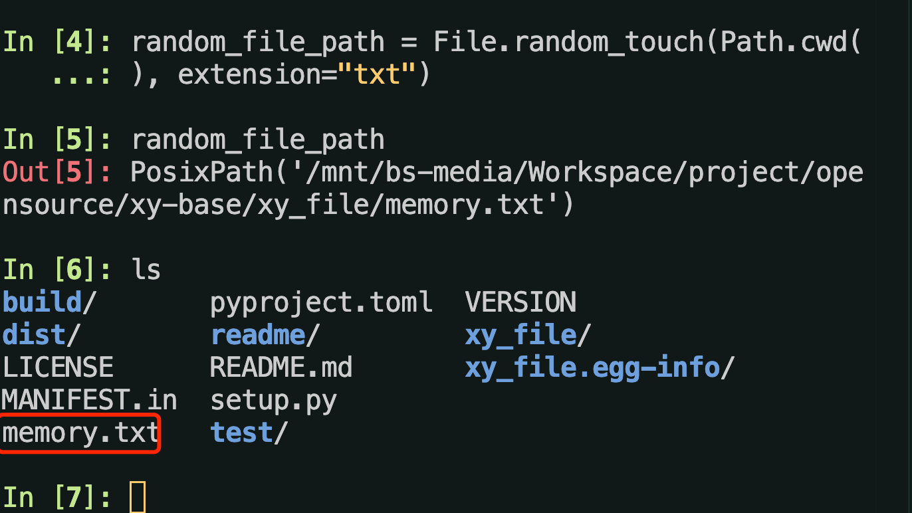
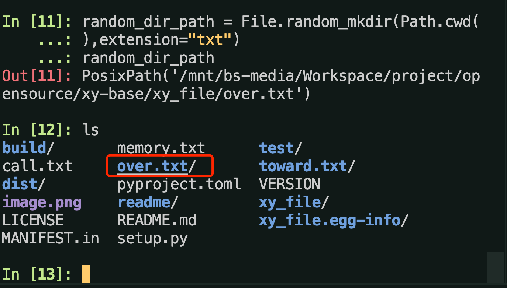

<!--
 * @Author: yuyangit yuyangit.0515@qq.com
 * @Date: 2024-10-18 20:12:00
 * @LastEditors: yuyangit yuyangit.0515@qq.com
 * @LastEditTime: 2024-10-18 20:18:30
 * @FilePath: /xy_file/readme/README.zh-hant.md
 * @Description: 这是默认设置,请设置`customMade`, 打开koroFileHeader查看配置 进行设置: https://github.com/OBKoro1/koro1FileHeader/wiki/%E9%85%8D%E7%BD%AE
-->
# xy_file

| [简体中文](../README.md)         | [繁體中文](./README.zh-hant.md)        |                      [English](./README.en.md)          |
| ----------- | -------------|---------------------------------------|

## 說明
簡單檔操作工具，特殊功能為不同路徑匹配規則的添加。

## 程式碼庫

| [Github](https://github.com/xy-base/xy_file.git)         | [Gitee](https://gitee.com/xy-opensource/xy_file.git)        |                      [GitCode](https://gitcode.com/xy-opensource/xy_file.git)          |
| ----------- | -------------|---------------------------------------|


## 安裝

```bash
# bash
pip install xy_file
```

## 使用

### 1. 命令行

⚠️⚠️⚠️ 以下所有指令加上 -yy 將強制執行,無須使用者選擇是否繼續執行.

- [ ] 1.1 - 顯示幫助

```bash
# bash

xy_file -h

# usage: xy_file-1.0.5 [-h] -w [WORK] [-y [YES]]
#                      [-d [WORK_DIR]]
#                      [-r [RGLOB_KEYWORD]]
#                      [-k [KEYWORD]]
#                      [-regf [REGEX_FLAG]]
#                      [-i [IGNORE_HIDDEN_FILES]]
#                      [-f [FILE_TYPE_FILTER]]
#                      [-e [EXTENSION]] [-l [LOCALE]]
#                      [-ds [DEEP_START]]
#                      [-dc [DEEP_COUNT]] [-t [COUNT]]
#                      [-sp [SOURCE_PATTERN]]
#                      [-tp [REPLACE]]

# 文件管理应用

# options:
#   -h, --help            show this help message and
#                         exit
#   -w [WORK], --work [WORK]
#                         命令: clean | c =>
#                         常用清理文件或目录,通配符匹配, 配合
#                         -r/--rglob-keyword 使用, 默认
#                         **/*, 表示当前目录下所有匹配的文件和目录;
#                         search_clean | sc =>
#                         正则表达式搜索文件或目录来清理文件或目录, 配合
#                         -k/--keyword 使用, 必须符合正则表达式;
#                         rglob_files | rf =>
#                         通配符匹配文件或目录, 配合 -r/--rglob-
#                         keyword 使用, 默认 **/*,
#                         表示当前目录下所有匹配的文件和目录;
#                         search_files | sf =>
#                         正则表达式搜索文件或目录,, 配合
#                         -k/--keyword 使用, 必须符合正则表达式;
#                         rename_files | r =>
#                         正则表达式匹配来重命名文件或目录,, 配合
#                         -k/--keyword 使用, 必须符合正则表达式;
#                         random_touch | rt => 创建随机文件;
#                         random_mkdir | rm => 创建随机目录,
#                         默认会生成带后缀的文件名, 使用 (xy_file -w
#                         rm -e "") 来创建不带后缀的随机目录;
#                         random_file_name | rfn =>
#                         生成随机文件路径;
#   -y [YES], --yes [YES]
#                         随便填写-y开头的参数如: -yy.就会强制运行,
#                         所有过程遇到提示都默认为Yes;
#   -d [WORK_DIR], --work-dir [WORK_DIR]
#                         工作目录, 默认当前工作目录, Path.cwd();
#   -r [RGLOB_KEYWORD], --rglob-keyword [RGLOB_KEYWORD]
#                         通配符 工作目录过滤匹配关键字; 默认: **/*,
#                         当前目录下的全部文件和目录，
#                         可选，工作目录过滤关键字，使用通配符进行匹配，例如
#                         *.py表示当前目录下所有py脚本
#   -k [KEYWORD], --keyword [KEYWORD]
#                         关键字; 可选; 使用正则表达式Search,
#                         Rename; 默认: re.M模式, !!! 注意:
#                         该关键字匹配是绝对路径字符串
#   -regf [REGEX_FLAG], --regex-flag [REGEX_FLAG]
#                         匹配模式: 2 => re.I, 8 => re.M,
#                         16 => re.S, 32 => re.U, 64 =>
#                         re.X
#   -i [IGNORE_HIDDEN_FILES], --ignore-hidden-files [IGNORE_HIDDEN_FILES]
#                         是否忽略隐藏目录和文件
#   -f [FILE_TYPE_FILTER], --file-type-filter [FILE_TYPE_FILTER]
#                         过滤器, 默认为0; 无限制, !!!
#                         若输入字符串则无大小写限制, 以下为过滤器对应类型: 任意
#                         = [0, any], 文件 = [1, file],
#                         目录/文件夹 = [2, dir], 软链接 = [3,
#                         symlink], 硬链接 = [4,
#                         hardlink], Socket = [5,
#                         socket], 字符设备(char device) =
#                         [6, char_device], 块设备(block
#                         device) = [7, block_device],
#                         管道(fifo) = [8, fifo],
#   -e [EXTENSION], --extension [EXTENSION]
#                         文件后缀, 用于随机生成文件或目录
#   -l [LOCALE], --locale [LOCALE]
#                         语言环境, 默认英文 => en, 简体中文 =>
#                         zh_CN
#   -ds [DEEP_START], --deep-start [DEEP_START]
#                         路径深度: 0 => 绝对路径所有, -1 =>
#                         最后文件名.
#   -dc [DEEP_COUNT], --deep-count [DEEP_COUNT]
#                         递归深度: -1 => 递归所有, 0 => 仅当前, 1
#                         => 当前+1级, 2 => 当前+2级, ...
#   -t [COUNT], --count [COUNT]
#                         匹配次数, 0 => 无限制, 其他按输入次数为匹配次数
#   -sp [SOURCE_PATTERN], --source-pattern [SOURCE_PATTERN]
#                         源匹配式, 需符合正则表达式
#   -tp [REPLACE], --replace [REPLACE]
#                         目标匹配式, 需符合正则表达式

```

- [ ] 1.2 產生並列印隨機檔案路徑, 若需要隨機目錄路徑, 擴充參數輸入"", 如 xy_file -w rfn -e ""
```bash
# bash
xy_file -w rfn

# =======================================================
# 生成新的随机文件路径 => 
# /mnt/bs-media/Workspace/project/opensource/xy-base/xy_f
# ile/test/likely.tiff
```

- [ ] 1.3 使用通配符清理文件

```bash
# bash
# 删除当前目录下所有 后缀为py 文件
xy_file -w c -r "*.py"
# =======================================================
# 将要删除... => [文件] 
# /mnt/bs-media/Workspace/project/opensource/xy-base/xy_f
# ile/test/model.py

# =======================================================
# 将要删除... => [文件] 
# /mnt/bs-media/Workspace/project/opensource/xy-base/xy_f
# ile/test/hear.py

# =======================================================
# 将要删除... => [文件] 
# /mnt/bs-media/Workspace/project/opensource/xy-base/xy_f
# ile/test/those.py

# =======================================================
# 将要删除... => [文件] 
# /mnt/bs-media/Workspace/project/opensource/xy-base/xy_f
# ile/test/and.py

# =======================================================
# 将要删除... => [文件] 
# /mnt/bs-media/Workspace/project/opensource/xy-base/xy_f
# ile/test/enjoy.py

# =======================================================
# 是否清理以上对象?

# =======================================================
# 确定请输入Y, 输入其他为取消清理命令. 请输入[Y/n]

```

- [ ] 1.4 正規表示式搜尋檔案或目錄來清理檔案或目錄

> 配合 -k/--keyword 使用, 必須符合正規表示式;

```bash
# bash
xy_file -w sc -k ".*.odp"
# 
# =======================================================
# 将要删除... => [文件] 
# /mnt/bs-media/Workspace/project/opensource/xy-base/xy_f
# ile/test/with.odp

# =======================================================
# 将要删除... => [文件] 
# /mnt/bs-media/Workspace/project/opensource/xy-base/xy_f
# ile/test/why.odp

# =======================================================
# 是否清理以上对象?

# =======================================================
# 确定请输入Y, 输入其他为取消清理命令. 请输入[Y/n]

```

- [ ] 1.5 使用正規表示式匹配進行重命名檔案或目錄

```bash
# bash

xy_file -w r -sp ".xt" -rp ".txt"
# =======================================================
# 匹配到... => [文件] 
# /mnt/bs-media/Workspace/project/opensource/xy-base/xy_f
# ile/test/move.txt
# 修改为: ==> 
# /mnt/bs-media/Workspace/project/opensource/xy-base/xy_f
# ile/test/move..txt

# =======================================================
# 匹配到... => [文件] 
# /mnt/bs-media/Workspace/project/opensource/xy-base/xy_f
# ile/test/everyone.txt
# 修改为: ==> 
# /mnt/bs-media/Workspace/project/opensource/xy-base/xy_f
# ile/test/everyone..txt

# =======================================================
# 匹配到... => [文件] 
# /mnt/bs-media/Workspace/project/opensource/xy-base/xy_f
# ile/test/reveal.txt
# 修改为: ==> 
# /mnt/bs-media/Workspace/project/opensource/xy-base/xy_f
# ile/test/reveal..txt

# =======================================================
# 匹配到... => [文件] 
# /mnt/bs-media/Workspace/project/opensource/xy-base/xy_f
# ile/test/movie.txt
# 修改为: ==> 
# /mnt/bs-media/Workspace/project/opensource/xy-base/xy_f
# ile/test/movie..txt

# =======================================================
# 匹配到... => [文件] 
# /mnt/bs-media/Workspace/project/opensource/xy-base/xy_f
# ile/test/job.txt
# 修改为: ==> 
# /mnt/bs-media/Workspace/project/opensource/xy-base/xy_f
# ile/test/job..txt

# =======================================================
# 匹配到... => [文件] 
# /mnt/bs-media/Workspace/project/opensource/xy-base/xy_f
# ile/test/real.txt
# 修改为: ==> 
# /mnt/bs-media/Workspace/project/opensource/xy-base/xy_f
# ile/test/real..txt

# =======================================================
# 匹配到... => [文件] 
# /mnt/bs-media/Workspace/project/opensource/xy-base/xy_f
# ile/test/face.txt
# 修改为: ==> 
# /mnt/bs-media/Workspace/project/opensource/xy-base/xy_f
# ile/test/face..txt

# =======================================================
# 匹配到... => [文件] 
# /mnt/bs-media/Workspace/project/opensource/xy-base/xy_f
# ile/test/live.txt
# 修改为: ==> 
# /mnt/bs-media/Workspace/project/opensource/xy-base/xy_f
# ile/test/live..txt

# =======================================================
# 匹配到... => [文件] 
# /mnt/bs-media/Workspace/project/opensource/xy-base/xy_f
# ile/test/growth.txt
# 修改为: ==> 
# /mnt/bs-media/Workspace/project/opensource/xy-base/xy_f
# ile/test/growth..txt

# =======================================================
# 匹配到... => [文件] 
# /mnt/bs-media/Workspace/project/opensource/xy-base/xy_f
# ile/test/thing.txt
# 修改为: ==> 
# /mnt/bs-media/Workspace/project/opensource/xy-base/xy_f
# ile/test/thing..txt

# =======================================================
# 匹配到... => [文件] 
# /mnt/bs-media/Workspace/project/opensource/xy-base/xy_f
# ile/test/consider.txt
# 修改为: ==> 
# /mnt/bs-media/Workspace/project/opensource/xy-base/xy_f
# ile/test/consider..txt

# =======================================================
# 是否重命名以上目录?

# =======================================================
# 确定请输入Y, 输入其他为取消重命名命令. 请输入[Y/n]

```


###### 2. Python腳本

```python
# Python 解释器
from xy_file.Object.File import File
from pathlib import Path
touch_file_path = Path.cwd().joinpath("test.txt")
# 创建文件当该文件路径为空
file_path = File.touch(touch_file_path)
# 如果file_path不为空 说明创建空文件成功
dir_path = File.mkdir(touch_file_path)
# 如果dir_path不为空 说明创建空目录成功

# 随机生成以txt为后缀的文件名
random_file_path = File.random_filename(Path.cwd(), "txt", locale="en")
random_file_path
# PosixPath('/mnt/bs-media/Workspace/project/opensource/xy-base/xy_file/safe.txt')
```

```python
# Python 解释器
# 随机创建以txt为后缀的文件
random_file_path = File.random_mkdir(Path.cwd(), extension="txt")
random_file_path
# PosixPath('/mnt/bs-media/Workspace/project/opensource/xy-base/xy_file/memory.txt')

```
> 結果示範如下:



```python
# Python 解释器
# 随机创建以txt为后缀的目录, 默认extension="", 使用后缀仅为说明该参数存在的用途
random_dir_path = File.random_mkdir(Path.cwd(),extension="txt")
random_dir_path
# PosixPath('/mnt/bs-media/Workspace/project/opensource/xy-base/xy_file/over.txt')
```

> 結果示範如下:



## 許可證
xy_file 根據 <木蘭寬鬆許可證, 第2版> 獲得許可。有關詳細信息，請參閱 [LICENSE](../LICENSE) 文件。

## 捐贈

如果小夥伴們覺得這些工具還不錯的話，能否請咱喝一杯咖啡呢?  


## 聯繫方式

```
微信: yuyangiit
郵箱: yuyangit.0515@qq.com
```